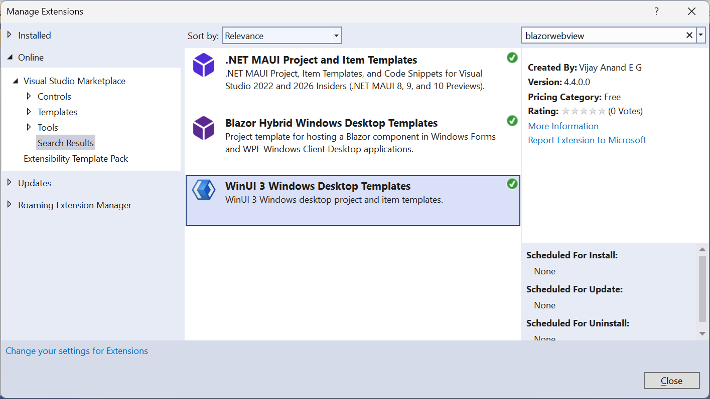

## Project and Item Templates for WinUI 3 based Windows Desktop Apps

Join me on [**Developer Thoughts**](https://egvijayanand.in/ "Developer Thoughts"), an exclusive blog for .NET MAUI and Blazor.

### Package Status:

|Channel|NuGet|VS Marketplace|
|:---:|:---:|:---:|
|Stable|[](https://www.nuget.org/packages/VijayAnand.WinUITemplates/ "WinUI 3 CLI Templates (Stable)")|[](https://marketplace.visualstudio.com/items?itemName=egvijayanand.winui-templates)|
<!--
|Preview|[](https://www.nuget.org/packages/VijayAnand.WinUITemplates/absoluteLatest "WinUI 3 CLI Templates (Preview)")|[](https://marketplace.visualstudio.com/items?itemName=egvijayanand.winui-templates)|
-->

<!-- CLI project template for developing `WinUI 3` App and Class Library and is named as `winui` and `winuilib` respectively. -->

### .NET CLI Template

To install the template NuGet package, use the below .NET CLI command:

Latest stable version:

```shell
dotnet new install VijayAnand.WinUITemplates
```

<!--
Latest preview version:

```shell
dotnet new install VijayAnand.WinUITemplates::2.2.0-preview.4
```
-->

If you've already installed this package, then it can be updated to the latest version with the below command:

```shell
dotnet new update --check-only
```

```shell
dotnet new update
```

### For Visual Studio users (both VS2022 and VS2026 release):

To provide an integrated experience, a VS extension has been developed to host these templates.

The VS extension is now supported on both **x64 and ARM64** installations of Visual Studio 2022 and 2026 release. Happy coding!

*Consequently, the minimum supported version of Visual Studio 2022 will be v17.6 or higher.*

**The v4.4 or higher extension is now compatible with the Visual Studio 2026 release v18.0.0**

Extension is made available in the [Visual Studio Marketplace](https://marketplace.visualstudio.com/items?itemName=egvijayanand.winui-templates "WinUI 3 Windows Desktop Templates") and even more easier, can be installed from within Visual Studio itself (Extensions -> Manage Extensions / Alt + X + M).



### Templates Included

|Item|Template Name|Type|
|:---:|:---:|:---:|
|WinUI 3 App|winui|Project|
|WinUI 3 Blazor App|winui-blazor|Project|
|WinUI 3 Class Library|winuilib|Project|
|WinUI 3 Page|winui-page|Item|
|WinUI 3 UserControl|winui-usercontrol|Item|
|WinUI 3 Window|winui-window|Item|

All three project templates takes the target framework as an input parameter, can be specified with `--framework` / `-f`.

And the supported values are:

* net8.0
* net9.0
* net10.0 *(the default value)*

Note: The default value for the `framework` parameter remains as `net10.0` (the latest stable release), which means to create a project for `.NET 8` or `.NET 9`, an explicit value of `net8.0` / `net9.0` is to be passed.

All three project templates take the below optional parameter to include the officially supported [CommunityToolkit.Mvvm](https://www.nuget.org/packages/CommunityToolkit.Mvvm) NuGet package.

* `-imt` | `--include-mvvm-toolkit` - Default value is `false`

Both the **App** project takes another optional parameter thus allowing it to be created as MVVM supported solution using the same Microsoft MVVM Toolkit.

* `-mvvm` | `--use-mvvm` - Default value is `false`

Starting with [v3.1.0](https://www.nuget.org/packages/VijayAnand.WinUITemplates/3.1.0), all three project templates take the below optional parameter support NuGet's Central Package Management (CPM) feature.

* `-cpm` | `--central-pkg-mgmt` - Default value is `false`

Starting with [v3.3.0](https://www.nuget.org/packages/VijayAnand.WinUITemplates/3.3.0), added the ability to use the NuGet Central Package Management (CPM) feature within Visual Studio IDE.

Starting with [v3.4.0](https://www.nuget.org/packages/VijayAnand.WinUITemplates/3.4.0), introduced an option to support the XML-based solution file (slnx) format.

* `-slnx` | `--use-slnx` - Default value is `true` (from `v5.0` onwards)

Starting with [v4.0.0](https://www.nuget.org/packages/VijayAnand.WinUITemplates/4.0.0), added another option (`net10.0`) to the `framework` parameter to support .NET 10 Previews and revamped the WinUI Blazor project template.

Starting with [v4.2.0](https://www.nuget.org/packages/VijayAnand.WinUITemplates/4.2.0), introduced an option to abstract the Shared components as a separate .NET MAUI and/or Razor Class Library.

.NET MAUI XAML can be included within this .NET MAUI-specific class library.

* `-mcl` | `--maui-class-library` - Default value is `false`

This Razor Class Library allows code reuse with other projects such as ASP.NET Core.

* `-rcl` | `--razor-class-library` - Default value is `false`

Note: Use both options to segregate MAUI and Razor components into distinct libraries.

```shell
dotnet new winui-blazor -o MyApp -mcl
```

```shell
dotnet new winui-blazor -o SharedApp -rcl
```

```shell
dotnet new winui-blazor -o HybridApp -mcl -rcl
```

Starting with [v4.3.0](https://www.nuget.org/packages/VijayAnand.WinUITemplates/4.3.0), introduced an option to use Nightly builds with WinUI Blazor projects for .NET MAUI components, featuring automatic configuration of package feeds.

Nightly Builds support:

```shell
dotnet new winui-blazor -o NightlyApp -ni
```

*Note: These options may also be combined.*

<!-- CLI item template for `WinUI 3` Page, UserControl, and Window and is named as `winui-page`, `winui-usercontrol`, and `winui-window` respectively. -->

Use the below .NET CLI command to create the projects out these template:

### WinUI 3 App:

```shell
dotnet new winui -n MyApp
```

.NET 9:

```shell
dotnet new winui -n MyApp -f net9.0
```

.NET 8:

```shell
dotnet new winui -n MyApp -f net8.0
```

MVVM based solution:

```shell
dotnet new winui -n MyApp -mvvm
```

Option to include only the MVVM NuGet package:

```shell
dotnet new winui -n MyApp -imt
```

Option to use the CPM feature:

```shell
dotnet new winui -n MyApp -cpm
```

Option to create the classic SLN solution file:

```shell
dotnet new winui -n MyApp -slnx:false
```

### Blazor Hybrid App (using .NET MAUI Embedding feature):

```shell
dotnet new winui-blazor -n HybridApp
```

.NET 9:

```shell
dotnet new winui-blazor -n HybridApp -f net9.0
```

.NET 8:

```shell
dotnet new winui-blazor -n HybridApp -f net8.0
```

MVVM based solution:

```shell
dotnet new winui-blazor -n HybridApp -mvvm
```

Option to include only the MVVM NuGet package:

```shell
dotnet new winui-blazor -n HybridApp -imt
```

Option to use the CPM feature:

```shell
dotnet new winui-blazor -n HybridApp -cpm
```

Option to create the classic SLN solution file:

```shell
dotnet new winui-blazor -n HybridApp -slnx:false
```

### Library:

```shell
dotnet new winuilib -n MyLib
```

.NET 9:

```shell
dotnet new winuilib -n MyLib -f net9.0
```

.NET 8:

```shell
dotnet new winuilib -n MyLib -f net8.0
```

Option to include only the MVVM NuGet package:

```shell
dotnet new winuilib -n MyLib -imt
```

Option to use the CPM feature:

```shell
dotnet new winuilib -n MyLib -cpm
```

Option to create the SLNX solution file:

```shell
dotnet new winuilib -n MyLib -slnx
```

### Item Templates:

Use the below .NET CLI command to create the items out these template:

All these item templates require one mandatory parameter:

* `-n` | `--name` - Name of the item

Auto suffixing of the Type name is supported for the files created with the `Page` and `Window` item templates.

Page:
```shell
dotnet new winui-page -n Order
```

UserControl:
```shell
dotnet new winui-usercontrol -n CardView
```

Window:
```shell
dotnet new winui-window -n Home
```
